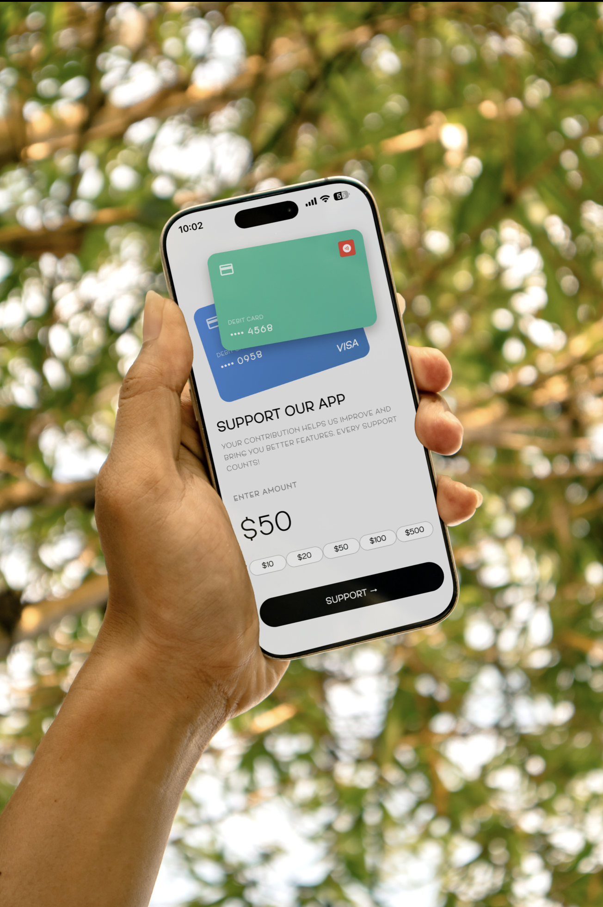

# AbyssiniaBot

<style>
@font-face {
  font-family: 'AndersonGrotesk Light';
  src: url('assets/Fonts/AndersonGrotesk Light.otf') format('opentype');
  font-weight: 300;
  font-style: normal;
}
</style>

A Flutter chatbot application with integrated Stripe payment system, powered by Google's Gemini AI.

## Features

- Interactive chat interface with AI-powered responses
- Powered by Google Gemini AI
- Stripe payment integration 
- Real-time message handling with state management

## Mockups

<div style="display: flex; gap: 16px; justify-content: center; align-items: flex-start; flex-wrap: wrap; font-family: 'AndersonGrotesk Light', -apple-system, system-ui, 'Segoe UI', Roboto, Arial, 'Noto Sans', 'Helvetica Neue', sans-serif;">
  
  
  
</div>

## Quick Start

### 1. Install Dependencies

```bash
flutter pub get
cd backend
npm install
```

### 2. Configure Environment Variables

Create a `.env` file in the `backend` folder:

```bash
cd backend
cp .env.example .env
```

Then edit `.env` and add your Stripe secret key:
```
STRIPE_SECRET_KEY=sk_test_your_actual_stripe_secret_key_here
PORT=3000
```

### 3. Start Backend Server

```bash
cd backend
npm start
```

Server runs on `http://localhost:3000`


## Technology Stack

### Frontend
- **Framework**: Flutter (Dart)
- **State Management**: GetX
- **HTTP Client**: http package
- **Payment**: flutter_stripe
- **UI Components**: Material Design 3

### Backend
- **Runtime**: Node.js
- **Framework**: Express.js
- **Payment Processing**: Stripe SDK
- **Environment**: dotenv

### AI Integration
- **Provider**: Google Gemini AI API

## Architecture

```
AbyssiniaBot
├── Frontend (Flutter)
│   ├── Screens (UI)
│   ├── Controllers (State Management)
│   ├── Services (API Integration)
│   └── Config (Environment)
│
└── Backend (Node.js)
    ├── Payment Endpoints
    ├── Webhook Handling
    └── API Routes
```

## Project Structure

```
lib/
├── screens/          # UI screens (chat, payment, home)
├── services/         # Business logic & API calls
├── controllers/      # State management with GetX
└── config/           # Configuration files

backend/
└── server.js         # Node.js Express server for Stripe
```
